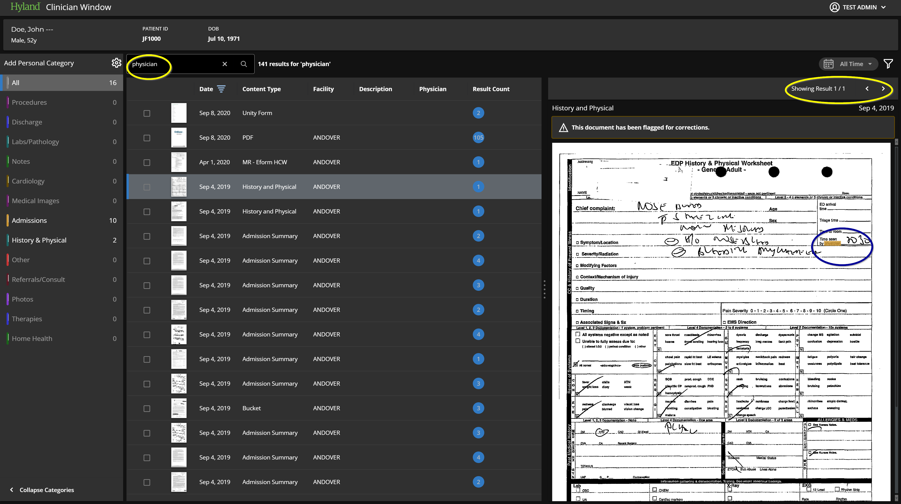

To enhance performance, I took advantage of LINQ's `AsParallel()` method for operations that were independent and read-only. This change significantly improved the speed; for example, the search time for patient JF1000 and the term "physician" dropped from 125 seconds to just 35 seconds.

Here is the internal class structure that was used:

```csharp
internal sealed class FullTextSearchService : IFullTextSearchService
{
    private readonly IFullTextEngine _fullTextEngine;
    private readonly IFullTextDataAccessProvider _fullTextDataAccessProvider;
    private readonly IFullTextRepository _fullTextRepository;
    private readonly IFullTextDocumentRenditionProvider _fullTextDocumentRenditionProvider;
    private readonly IFullTextDocumentDataProvider _fullTextDocumentDataProvider;
    private readonly ISession _session;

    private readonly ILegacyQueryFactory _legacyQueryFactory;

    private static readonly IEnumerable<FullTextPageData> EmptyFullTextPageData = ImmutableArray<FullTextPageData>.Empty;

    public FullTextSearchService(
        IFullTextDataAccessProvider fullTextDataAccessProvider,
        IFullTextEngine fullTextEngine,
        IFullTextRepository fullTextRepository,
        ILegacyQueryFactory legacyQueryFactory,
        IFullTextDocumentRenditionProvider fullTextDocumentRenditionProvider,
        IFullTextDocumentDataProvider fullTextDocumentDataProvider,
        ISession session)
    {
        _fullTextDataAccessProvider = fullTextDataAccessProvider ?? throw new ArgumentNullException(nameof(fullTextDataAccessProvider));
        _fullTextEngine = fullTextEngine ?? throw new ArgumentNullException(nameof(fullTextEngine));
        _fullTextRepository = fullTextRepository ?? throw new ArgumentNullException(nameof(fullTextRepository));
        _legacyQueryFactory = legacyQueryFactory ?? throw new ArgumentNullException(nameof(legacyQueryFactory));
        _fullTextDocumentRenditionProvider = fullTextDocumentRenditionProvider ?? throw new ArgumentNullException(nameof(fullTextDocumentRenditionProvider));
        _fullTextDocumentDataProvider = fullTextDocumentDataProvider ?? throw new ArgumentNullException(nameof(fullTextDocumentDataProvider));
        _session = session ?? throw new ArgumentNullException(nameof(session));
    }

    public ImmutableArray<(long documentId, FullTextSearchResults)> ExecuteFTSQuerySearch(string query, IImmutableList<long> docIds)
    {
        using (_session.Security.OverrideKeywordSecurityChecks())
        using (_session.Security.OverrideDocumentQuerySecurityChecks())
        {
            var results = BuildLegacyQuery(docIds, query).Execute();
            return GetFullTextSearchResults(results, query);
        }
    }

    private ILegacyQuery BuildLegacyQuery(IImmutableList<long> docIds, string searchString)
    {
        var legacyQuery = _legacyQueryFactory.Create();

        legacyQuery.SetSearchTerm(searchString);

        if (docIds.Any())
        {
            legacyQuery.AddIDListConstraint(docIds);
        }

        return legacyQuery;
    }

    private ImmutableArray<(long documentId, FullTextSearchResults)> GetFullTextSearchResults(ServerResults results, string query)
    {
        return GetTopScoredResults(results)
            .AsParallel()
            .Select(serverResult =>
            {
                var contentIndexIdentifier = CreateContentIndexFrom(serverResult);
                return (
                    serverResult.ID,
                    new FullTextSearchResults
                    {
                        PaginatedDocumentIndexProperties = new PaginatedDocumentIndexProperties
                        {
                            VersionId = contentIndexIdentifier.VersionID,
                            FileTypeId = contentIndexIdentifier.FileTypeID,
                            RevisionId = contentIndexIdentifier.RevisionID
                        },
                        HitCount = serverResult.HitCount,
                        FirstHitSynopsis = serverResult.Summary,
                        FullTextPageDataItems = GetFullTextPageHitData(query, contentIndexIdentifier).ToImmutableArray()
                    });
            }).ToImmutableArray();
    }

    private static IEnumerable<ServerResult> GetTopScoredResults(ServerResults results) => results.Where(grp => grp.HighestScore != null).Select(grp => grp.HighestScore);

    private static ContentIndexIdentifier CreateContentIndexFrom(ServerResult serverResult)
    {
        return new ContentIndexIdentifier(
            serverResult.Flags == PDFPagination ? PaginatedContent : StandardContent,
            serverResult.ID,
            serverResult.DocumentTypeID)
        {
            VersionID = serverResult.VersionID ?? 0,
            FileTypeID = serverResult.RenditionID,
            RevisionID = serverResult.RevisionID
        };
    }

    private IEnumerable<IFullTextPageData> GetFullTextPageHitData(string query, ContentIndexIdentifier indexId)
    {
        if (indexId == null) throw new ArgumentNullException(nameof(indexId));
        if (indexId.IdentifierType != PaginatedContent) return EmptyFullTextPageData;

        var ftDocument = _fullTextDataAccessProvider.Get().GetFullTextObjectID(
            indexId.ID,
            indexId.RevisionID,
            indexId.FileTypeID);

        var index = _fullTextRepository.GetIndex(_session, ftDocument.CatalogID);

        return _fullTextEngine.GetPagesWithHits(index.Location, ftDocument.FtObjectID, query, indexId)
            .OrderBy(pageNum => pageNum)
            .AsParallel()
            .AsOrdered()
            .Select(pageNumber =>
            {
                var highlightCoordinates =
                    _fullTextEngine.GetMatchingPaginatedCoordinates(
                            index,
                            ftDocument.FtObjectID,
                            pageNumber,
                            query,
                            indexId)
                        .Select(rectangle =>
                            new FullTextHitHighlightCoordinates
                            {
                                X = rectangle.X,
                                Y = rectangle.Y,
                                Width = rectangle.Width,
                                Height = rectangle.Height
                            });

                return BuildFullTextPageData(indexId, pageNumber, highlightCoordinates);
            });
    }

    private FullTextPageData BuildFullTextPageData(
        ContentIndexIdentifier indexId,
        int pageNumber,
        IEnumerable<IFullTextHitHighlightCoordinates> highlightCoordinates)
    {
        var pageData = GetPageData(pageNumber, indexId);

        return new FullTextPageData
        {
            PageNumber = pageNumber + 1, // convert to 1-based
            HitHighlightCoordinates = highlightCoordinates.ToImmutableArray(),
            PageImageHeight = pageData.ImageProperties.ImageHeight,
            PageImageWidth = pageData.ImageProperties.ImageWidth,
            HorizontalDpi = pageData.ImageProperties.HorizontalDPI,
            VerticalDpi = pageData.ImageProperties.VerticalDPI
        };
    }

    private PageData GetPageData(int pageNumber, ContentIndexIdentifier contentIndexIdentifier)
    {
        var getPageProperties = new GetPageProperties()
        {
            GeneralProperties =
            {
                PageNumber = pageNumber,
                ContentType = ContentType.PngImage
            }
        };

        var rendition = _fullTextDocumentRenditionProvider.GetRendition(_session, contentIndexIdentifier);

        return _fullTextDocumentDataProvider.GetPage(_session, rendition, pageNumber, getPageProperties);
    }
}
```



The `FullTextSearchService` class is a comprehensive implementation of an `IFullTextSearchService` interface, which is responsible for performing full-text search operations within a system. Here's a breakdown of its functionalities and the internal workings:

- **Fields**: The class has several private readonly fields representing various dependencies required to perform full-text search operations, such as access to the full-text engine, data access providers, repositories, document data providers, and session information.

- **Constructor**: The constructor takes instances of the dependencies as arguments and uses the null-coalescing operator to ensure none of the provided instances are null, throwing an `ArgumentNullException` if they are.

- **`ExecuteFTSQuerySearch` Method**:
    - This method takes a search query and a list of document IDs to perform a full-text search.
    - It overrides security checks for the session, presumably to allow for a broader search than the user's regular permissions would allow.
    - It then builds a legacy query with the provided document IDs and search string, executes it, and processes the results to return an array of tuples containing document IDs and their corresponding search results.

- **`BuildLegacyQuery` Helper Method**:
    - Constructs a legacy query using a factory pattern.
    - Sets the search term and, if a list of document IDs is provided, adds constraints to the query based on these IDs.

- **`GetFullTextSearchResults` Helper Method**:
    - Processes the results from the server to get the top-scored results, which are then parallelized to improve performance.
    - For each result, it creates a content index identifier, compiles the full-text search results including paginated document properties, hit counts, summaries, and full-text page data items.
    - It returns an immutable array of the compiled results.

- **`GetTopScoredResults` Static Helper Method**:
    - Filters the server results to only include those with a non-null highest score and returns these top-scored results.

- **`CreateContentIndexFrom` Static Helper Method**:
    - Creates and returns a `ContentIndexIdentifier` object from a `ServerResult`, which contains information about the content type, IDs, and document type IDs.

- **`GetFullTextPageHitData` Helper Method**:
    - Retrieves and processes full-text page data based on the search query and a content index identifier.
    - If the content is paginated, it retrieves the full-text object ID, retrieves the index from the full-text repository, and then gets the pages with hits from the full-text engine.
    - Orders the pages, parallelizes the processing, and builds full-text page data for each page number.

- **`BuildFullTextPageData` Helper Method**:
    - Constructs `FullTextPageData` objects for each page, including page number, hit highlight coordinates, and page image properties.

- **`GetPageData` Helper Method**:
    - Retrieves page data for a given page number and content index identifier, specifying the page properties and content type.

Overall, this class is a thorough implementation for a full-text search system, encapsulating the logic for querying, processing, and returning search results. It leverages parallel processing and immutable collections to ensure thread-safety and consistent data. The use of a session to override security checks indicates that this service might be used in a context where administrative-level search capabilities are required.